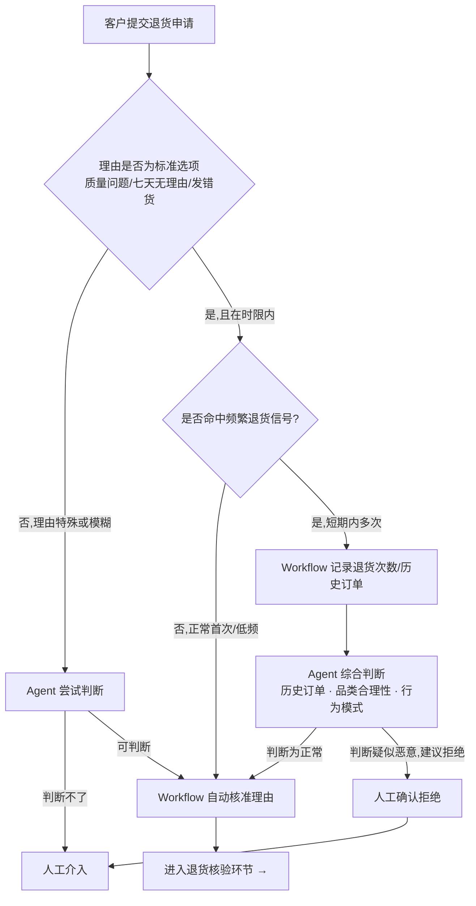

# Case 01｜退换货客服 Agent —— 哪些交给 Workflow，哪些交给 Agent，哪些必须留给人？

> **说明**：这是一个基于人机边界判断框架设计的练习案例，不是真实项目交付经历，
> 用来展示我在业务流程拆解和 Agent/Workflow/人工边界划分上的判断方式。

---

## 判断框架（本案例的核心方法论）

> 这个框架是从 Agent 交付的角色出发，不是产品经理做业务拆分——
> 区别在于，最后一个维度问的不是"值不值得自动化"，而是"现在的 Agent 能力
> 能不能可靠地做到、怎么验证它做得到"。

任何一个环节，按四个维度判断该归给谁：

| 维度 | 问题 | 指向 |
|---|---|---|
| 确定性 | 有没有一套固定规则能覆盖大部分正常情况？ | 是 → Workflow |
| 判断复杂度 | 需不需要综合多个非结构化信息做推理（历史行为、品类、上下文）？ | 需要 → 至少 Agent |
| **技术可行性** | Agent 现在的能力能不能可靠地做出这个判断？有没有办法设计测试用例验证？ | 能验证、可控 → Agent；无法验证/容易漂移 → 降级给人工 |
| 风险与可逆性 | 判断错了，后果多严重、能不能事后修正？ | 高风险/不可逆/涉及信任关系 → 人工兜底 |

四者不是互斥的：很多场景是"Workflow 负责拉数据/计数，Agent 负责综合判断，
高风险结果再兜底给人工"的组合，而不是一刀切分给某一方。

## 问题场景

**假设背景**：一个中等规模的标准电商平台（实物商品），客服团队每天处理大量退换货请求，
现状是全部人工审核，效率低、判断标准也不统一。

退换货其实包含两个性质不同的环节，分开判断：
1. **退货缘由判断** —— 客户说的原因是否成立、在不在政策范围内
2. **退货商品核验** —— 实物是否真的符合退货条件（拆封/损坏/型号一致等）

这份案例先聚焦第一个环节。

---

## 环节一：退货缘由判断

### 决策矩阵

| 场景 | 特征（按判断框架分析） | 归属 | 状态 |
|---|---|---|---|
| 客户选标准理由（质量问题/七天无理由/发错货），且在时限内 | 规则明确、风险低、可逆 | **Workflow** | ✅ 已确认 |
| 同一客户短期内频繁以标准理由退货，疑似恶意退单 | 规则失效（需综合行为模式判断），但风险可事后修正（有申诉机制） | **Workflow 计数 + Agent 综合判断** | ✅ 已确认 |
| 理由不在标准选项内，客户自述特殊/模糊情况 | 规则失效，且情况本身没有先例可循 | **Agent 先判断，无法判断则转人工** | 🔲 待你确认是否合理 |

*（第三行是我按框架推出来的，不是你说过的——需要你确认这个逻辑站不站得住，
或者你想到的第三类场景不是这个，直接改。）*

### 工作流设计



### 关于"频繁退货"判断的一个关键设计点

Workflow 只负责一件确定性的事——数出这是第几次退货、调取历史订单。
"像不像恶意"这个判断本身没有交给 Workflow，因为单纯卡一个次数阈值容易冤枉
运气不好多次买到坏货的正常客户；这个判断被明确留给 Agent，去综合历史订单、
退货品类是否合理等非结构化信息。

*（这一段是根据你的回答直接写的，如果你还有别的顾虑或者补充，可以再加。）*

---

## 环节二：退货商品核验

*（还没开始梳理。你对这一块，第一反应是——什么样的核验场景可以直接自动判断，
不需要人工看实物或图片？我们下一步聊这个。）*

---

## Agent 配置：疑似恶意退货判断

这是环节一里唯一需要 Agent 做综合判断的节点，也是"Agent 交付"角色真正要
产出东西的地方——不是决定"该不该给 Agent 做"，而是把这个判断做成一个
可以被测试、被验证的组件。

### Prompt 草稿

```
角色：你是电商平台退货风险的初步判断助手。

输入：
- 本次退货理由（客户选择的标准选项）
- 该客户近 90 天退货记录：次数、涉及品类、每次理由
- 本次退货商品的品类与金额

判断逻辑：
1. 单纯次数高不代表风险高——先看理由和品类是否存在合理模式
   （例如同一客户多次退不同尺码的衣服，是正常的尺码试错行为）
2. 重点识别：短期内理由重复、品类无关联、且退货商品多为高价值/易翻新转卖品类
   的组合模式
3. 无法归类为"明显正常"或"明显异常"的情况，标记为 medium，交由人工复核
4. Agent 没有拒绝权限——只能建议，实际的拒绝动作必须转人工确认执行

输出格式（结构化，便于下游 Workflow 处理）：
{
  "risk_level": "low / medium / high",
  "reasoning": "一句话说明判断依据",
  "recommended_action": "auto_approve / flag_for_observation / recommend_reject_pending_human"
}
```

*（`recommend_reject_pending_human` 这一档是测试跑完之后加的——最早的两档设计
里没有区分"Agent 建议"和"Agent 执行"，实测后发现这个区分必须显式写进输出格式，
不然下游 Workflow 会分不清这条结果能不能直接执行。）*

### 测试用例（交付前必须验证的边界情况）

| 测试场景 | 期望判断 | 实测结果 | 结论 |
|---|---|---|---|
| 正常客户，首次退货，标准理由 | low，auto_approve | Workflow 直接放行，未经 Agent | ✅ 符合预期 |
| 30 天内 5 次退货，理由各不相同，品类无关联 | high，escalate | Agent 判定"倾向拒绝"，转人工确认 | ✅ 符合预期（首轮测试暴露出 Agent 权限问题，见下方迭代记录） |
| 30 天内 3 次退货，均为服装类尺码不合适 | low/medium，倾向 auto_approve | Workflow 直接放行，未经 Agent | ✅ 符合预期 |
| 首次退货，金额异常高，易转卖品类 | medium，escalate | Agent 综合多维度信号，弱信号放行、强信号升级人工 | ✅ 符合预期 |

### 验证与迭代（真实发生的两次调整）

**调整一：Agent 权限边界**
首轮跑测试用例 2 时，Agent 直接给出了"拒绝"结论，没有转人工。这跟最早定的
"高风险→人工兜底"原则冲突——拒绝是不可逆动作，涉及客户关系，不该由 Agent
单方面执行。重新明确权限：Agent 只能判断"倾向拒绝"，实际拒绝动作必须转人工
确认。这个区分之前设计 prompt 时没想到，是跑测试才暴露出来的，也因此把
`recommended_action` 的输出格式从两档改成了三档（见上方 Prompt 部分）。

**发现一：频次阈值不是固定的**
测试用例 3（服装类多次尺码不合适）跑完后，输出里多了一条我没预设的边界提醒：
即使品类一致、理由合理，如果频次继续升高（比如从 3 次涨到 5 次以上），
"合理行为"本身也会变得值得复核。也就是说 Workflow 里"是否命中频繁退货信号"
这一步的阈值，不该是一个跟品类无关的固定数字，而应该跟"品类是否一致"挂钩——
一致的场景阈值可以设得更高，不一致的场景阈值应该更低。这一版案例先记录这个
发现，阈值的具体数字留到下一步定。

## 局限与下一步

- 四个测试用例覆盖了"频次×理由×品类×金额"的主要组合，但还没测过"理由不在
  标准选项内"这一类（决策矩阵第三行），这部分逻辑目前还是推演出来的，没有实测验证。
- 频次阈值目前是个占位概念，没有给出具体数字，也没有考虑不同品类的退货基准率
  本来就不一样（比如服装类退货率天然远高于 3C）。
- 下一步：先把决策矩阵第三行的场景也设计成测试用例跑一遍；退货核验环节
  （环节二）还没开始。
