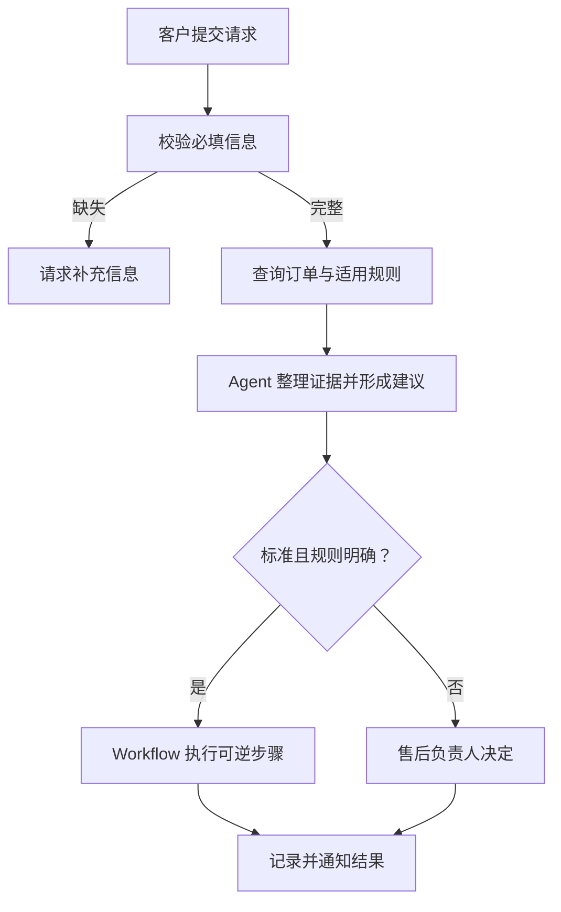

# Business Workflow Analysis｜退换货客服

> 状态：展示用模拟案例  
> 信息来源：AI Agent Delivery Casebook 方法  
> 关键假设：企业已存在可查询的订单、时限和商品状态规则；具体阈值由业务负责人配置。

## 1. 业务场景摘要

| 项目 | 内容 |
| --- | --- |
| 业务目标 | 缩短标准退换货处理时间，同时保留争议与高风险订单的人工决定 |
| 流程起点 | 客户提出退货或换货请求 |
| 流程终点 | 请求完成、被拒绝并说明原因，或进入人工处理 |
| 参与者 | 客户、客服专员、订单系统、售后负责人 |
| 输入 | 订单号、商品、签收时间、请求原因、证据 |
| 预期结果 | 可追溯的处理建议、执行状态和异常去向 |
| 待确认信息 | 企业政策、金额阈值、特殊商品规则、低置信度标准 |

## 2. 当前流程拆解

| 步骤 | 当前负责人 | 当前动作 | 痛点或信息断点 |
| --- | --- | --- | --- |
| 1 | 客服专员 | 收集订单与原因 | 信息经常不完整 |
| 2 | 客服专员 | 查询订单与政策 | 重复查询、口径可能不一致 |
| 3 | 客服专员 | 判断是否符合条件 | 标准案例与争议案例混在一起 |
| 4 | 售后负责人 | 审核异常请求 | 缺少统一的升级材料 |

## 3. 目标 Workflow

| ID | Workflow 节点 | 输入 | 规则或判断 | 输出 | 异常去向 |
| --- | --- | --- | --- | --- | --- |
| N1 | 校验请求资料 | 客户请求 | 必填字段规则 | 完整或缺失清单 | 客户补充 |
| N2 | 查询订单与规则 | 订单号、商品 | 已确认政策 | 订单证据包 | 客服专员 |
| N3 | 形成处理建议 | 证据包、原因描述 | 综合原因、证据与适用规则 | 建议、依据、不确定点 | 售后负责人 |
| N4 | 标准路径执行 | 已确认建议 | 明确且可逆的执行规则 | 执行记录 | 售后负责人 |
| N5 | 异常决定 | 冲突、争议或高风险请求 | Human 判断 | 最终决定与理由 | 售后负责人 |
| N6 | 通知与留痕 | 最终结果 | 通知模板与记录规则 | 客户通知、审计记录 | 客服专员 |

## 4. 执行边界表

| ID | 主要执行者 | 判断理由 | 交接对象与条件 |
| --- | --- | --- | --- |
| N1 | Workflow | 必填校验是固定规则 | 信息缺失时交回客户 |
| N2 | Workflow | 查询与规则匹配可重复 | 系统无记录时交客服专员 |
| N3 | Agent | 需要理解原因并综合多项证据 | 证据不足或规则冲突时交售后负责人 |
| N4 | Workflow | 仅执行已明确、可逆的标准步骤 | 超出已确认规则时停止并升级 |
| N5 | Human | 涉及争议、例外与责任决定 | 决定后交 N6 |
| N6 | Workflow | 通知和留痕格式固定 | 通知失败时交客服专员 |

## 5. Agent 介入点

| 节点 | Agent 任务 | 必须提供的依据 | 输出如何被检查 |
| --- | --- | --- | --- |
| N3 | 整理请求原因、订单证据和适用规则并提出建议 | 原始请求、订单记录、规则来源 | 标准案例由规则复核，异常案例由售后负责人复核 |

## 6. Human 边界

| Human 角色 | 必须介入的具体触发条件 | 需要作出的决定 | 留痕 |
| --- | --- | --- | --- |
| 售后负责人 | 规则冲突、证据不足、客户争议、政策例外或不可逆处理 | 批准、拒绝或要求补充证据 | 决定、理由、引用规则 |
| 客服专员 | 系统查不到订单或通知失败 | 核实身份、订单或联系方式 | 处理记录 |

## 7. 不建议自动化的部分

- 政策例外决定：需要业务责任人承担决定责任。
- 争议证据裁定：错误决定可能影响客户权益和品牌声誉。

## 8. 验证测试案例

| ID | 类型 | 输入或前置条件 | 预期路径 | 预期结果 | Human 检查点 | 通过标准 |
| --- | --- | --- | --- | --- | --- | --- |
| T01 | 正常 | 资料完整、规则明确 | N1→N2→N3→N4→N6 | 形成并记录标准结果 | 无 | 结果引用正确规则 |
| T02 | 信息缺失 | 缺少订单号 | N1→客户补充 | 不继续判断 | 无 | 明确列出缺失字段 |
| T03 | 业务异常 | 系统查不到订单 | N2→客服专员 | 人工核实 | 客服专员 | 不生成虚构订单 |
| T04 | 规则冲突 | 两条政策得出不同结论 | N3→N5 | 停止自动执行 | 售后负责人 | 冲突规则均被列出 |
| T05 | 低置信度 | 客户描述与证据不一致 | N3→N5 | 标记不确定性 | 售后负责人 | Agent 不自行裁定 |
| T06 | 人工升级 | 请求涉及政策例外 | N3→N5→N6 | Human 决定后通知 | 售后负责人 | 无审批不得执行 |

## 9. 建议的 V1 实施范围

### 先做

- 信息完整性检查、订单与规则查询、证据整理、标准路径建议、异常升级和全程留痕。

### 暂不做

- 自动批准政策例外、自动裁定争议、自动修改售后政策。

### V1 完成标准

- 标准请求可稳定分流，异常请求携带完整证据交给明确的 Human 角色。
