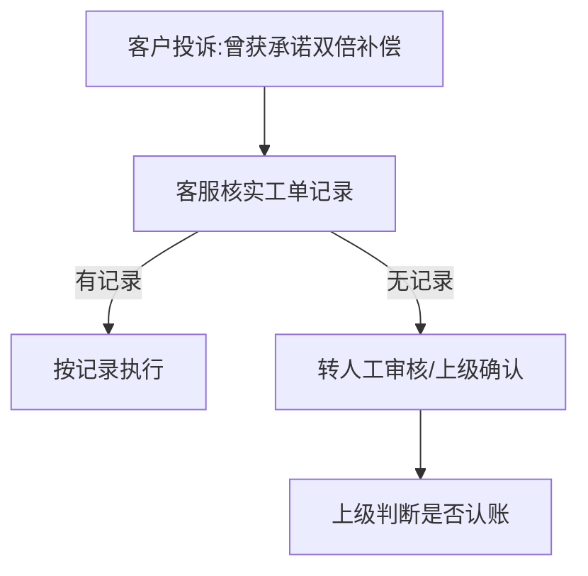
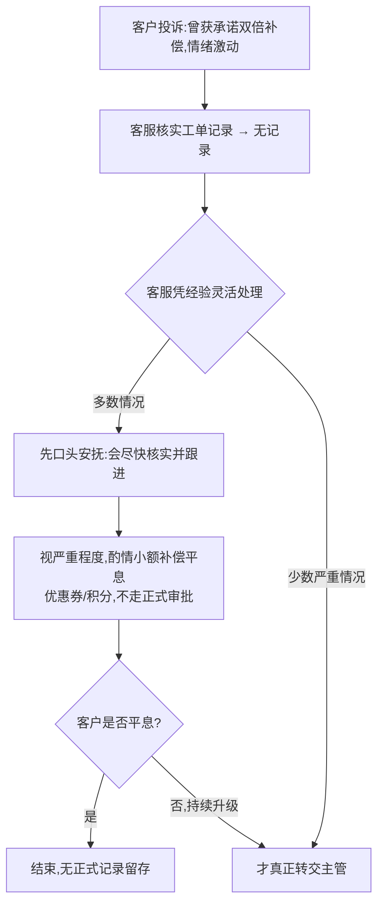

# Case 02｜从人工客服流程到 AI Agent：第一步不是开发，而是流程映射

> 说明：这是一个基于流程映射方法设计的练习案例，不是真实项目交付经历。
> 用来展示我在设计 Agent 方案之前，如何验证业务流程是否真实。
---

## 问题场景

**假设背景**：延续案例 1 的电商平台假设，但这次视角拉高——不只是退换货，
而是整个客服工单处理流程。客服主管提供了一份流程说明，用来作为 Agent 方案
设计的起点。

在正式设计 Agent 方案之前，需要先回答一个问题：**主管描述的流程，等不等于
一线客服真实在做的流程？** 两者之间的落差，往往正是后续判断"哪里能自动化、
哪里必须留给 Agent 推理、哪里必须留给人"的关键输入——如果这一步跳过，
直接照着主管的说法设计方案，很可能会漏掉一线执行中真实存在的判断环节。

## 如何发现流程偏差

访谈的目的不是验证主管说的对不对，而是找"哪里主管的描述和一线实际执行
不一致"。几类值得问的问题：

- **例外处理类**：主管描述的流程里，遇到"流程手册没写的情况"时，一线
  实际是怎么处理的？（这类问题最容易挖出隐藏的判断逻辑）
- **人肉补丁类**：有没有哪个步骤，一线员工其实在用自己的经验/土办法处理，
  而不是按标准流程走？
- **跳步类**：流程图上写了要做的某一步，一线是不是经常因为效率原因跳过？
  跳过之后靠什么补救？
- **升级触发类**：主管说"遇到复杂情况转人工/转上级"，但"复杂"具体指什么，
  一线员工心里的判断标准和主管说的是不是一回事？

*（下面这部分需要你先想一个具体场景：假设你去问了客服主管、又去问了
一线客服，两边的说法在哪个具体环节上出现了偏差？这是本案例真正的内容，
需要具体想清楚才能往下写。）*

## 流程对照

**场景素材**：客户情绪激动，声称之前客服承诺过"双倍补偿"，但系统工单记录里查无此事。

**主管描述的流程**

**一线实际执行的流程**

## 差异分析

| 环节 | 主管说的 | 一线实际做的 | 为什么这个差异对 Agent 设计重要 |
|---|---|---|---|
| 无记录时的处理 | 直接转人工审核，等待上级判断 | 先做情绪安抚+视情况小额补偿平息，只有严重的才真正上报 | 如果 Agent 照搬"无记录→转人工"，会丢掉一线现在用来缓冲等待时间、防止客诉升级的动作，Agent 上线后体验反而可能比现在更差 |
| 安抚话术/软性沟通 | 流程手册里没有这一块 | 客服凭个人经验组织安抚语言，标准不一，效果因人而异 | 这恰恰是最该被结构化的地方——问题不是"要不要转人工"，而是"转人工之前那段等待期该怎么处理"，之前从没被正式设计过 |
| 补偿授权范围 | 补偿需要走审批 | 一线客服实际上有隐性的自由裁量权，只是没写进制度 | 不了解这个隐性权限，设计时容易把 Agent 本可以自主处理的小额安抚，也一并划进"必须转人工"，造成响应变慢 |

## 衔接案例 1

这次发现的偏差，指向案例 1 框架里"确定性"这个维度被高估了——主管以为"无记录→转人工"这条规则很清楚，但实际上转人工之前，一线一直在做一段没人正式设计过的灵活处理。这也呼应了案例 1 里"AI 没有可推理的信息源就不该自动拍板"的结论，但补了一句：**"转人工"不等于 Agent 什么都不做**——等待期间 Agent 依然可以做记录、安抚、信息整理，把这部分从"客服全凭个人经验"变成"有标准动作可依"，减轻真正转人工之后的处理成本。
------
