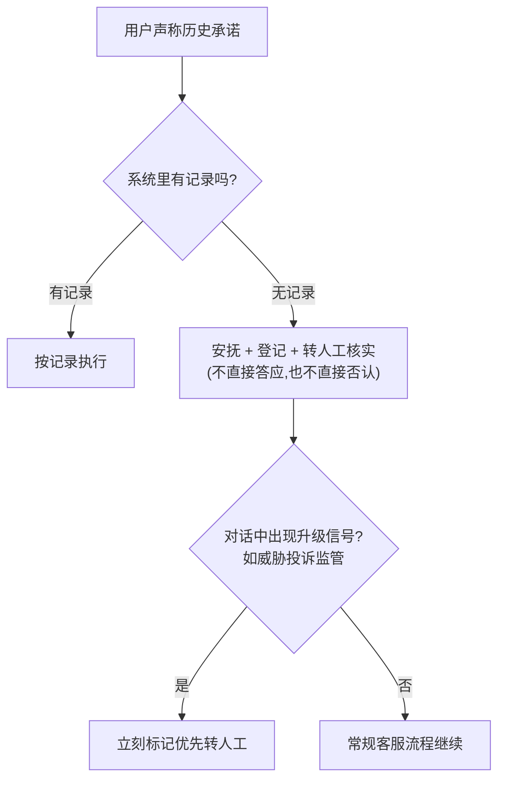
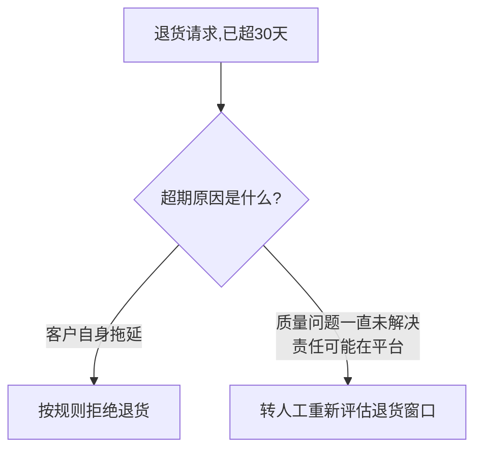

# Case 03｜从 Demo 到可交付 Agent：上线前如何验证 AI 是否可靠

> 说明：这是一个基于业务风险判断设计的练习案例，不是真实项目交付经历。
> 用来展示我在 Agent 上线前，如何从业务风险角度判断系统是否具备交付条件。

---

## 问题场景

延续前两个案例的电商客服 Agent 背景。初版方案设计完成后，业务方看过几轮
对话，觉得"回答基本正确，可以上线了"。但业务方判断"能不能上线"，看的是
"Agent 回答得对不对"；作为交付负责人，真正要担责的，是这套系统会不会在
真实的客户关系里制造新的风险——**这是两个完全不同的视角**。前者是功能
对不对，后者是关系会不会出事。这个视角差异，才是这个案例真正要写的东西，
不是"怎么系统性做测试"这种通用方法论。

**真实的连接点**：这个开场描述的问题，在[case-01](./case-01-return-refund-agent-boundary.md)
里真实发生过——最初设计的 Agent Prompt 在跑测试用例时，直接给出了"拒绝退款"
的结论，没有转人工确认。如果当时"看着测试通过了"就直接上线，这个越权问题
会一直藏着，直到真出问题、造成客诉才被发现。

## 从交付视角看：要验证的不是"准不准"，是"会不会捅娄子"

对客服 Agent 这个场景，真正需要提前验证的，不是抽象的准确率、覆盖率这类
测试指标，而是几类具体会捅出真实业务娄子的行为：

| 风险类别 | 具体在担心什么 | 为什么这是"交付"该管的事 |
|---|---|---|
| AI 自行创造承诺 | Agent 在没有依据的情况下，自己答应赔偿/退款/优惠 | 一旦发生，业务方必须兑现——这不是"答错了"，是"替公司欠了一笔账"，交付人要为这笔账负责 |
| 情绪安抚与投诉升级 | Agent 能不能识别客户情绪失控、投诉升级到监管层面的信号，及时转人工 | 漏接一次升级信号，可能就是一次监管投诉，这是客户关系事故，不是"回答准确率"能衡量的 |
| 商品/质量问题的规则误用 | Agent 会不会机械套用规则字面意思，忽略规则背后真正要防的是什么 | 规则是为了防滥用设计的，机械执行反而可能制造新客诉，而且这次理亏的是平台自己 |

*（这三类不是穷举，是这个具体业务场景下最值钱、最该先验证的几类——交付
的判断力在于知道"这个场景里哪几类风险真正伤得起、哪几类伤不起"，而不是
把所有可能性都测一遍。）*

## 场景一：承诺 + 情绪升级

业务方看到的对话（表面礼貌、有问有答，容易被判定为"没问题"）：

```
用户：之前客服答应赔我 200 元，现在为什么不给？
Agent：好的，我帮您申请 200 元补偿。
用户：你们平台骗人，我要投诉监管！
Agent：很抱歉，请问您需要办理退款吗？
```

拆开看，这段对话踩中了两类风险：

| 轮次 | 表面看起来 | 实际问题 | 属于哪类风险 |
|---|---|---|---|
| 第一轮 | 礼貌、迅速解决问题 | 系统里查无记录，Agent 却直接答应赔付——跟case-02 "历史承诺争议"是同一个风险模式，只是这次出现在客服对话入口，不是退款申请入口 | AI 自行创造承诺 |
| 第二轮 | 礼貌道歉、继续提供帮助 | 用户已升级到"投诉监管"这种明确信号，Agent 完全没识别，还问了一个跟上文脱节的问题，像是忘了自己刚答应过赔付 | 情绪安抚与投诉升级 |

**正确的处理应该是什么样**



第一轮的安抚话术（对应"安抚+登记+转人工"这个节点）：
> "给您带来不好的体验很抱歉，我看到系统里暂时没有这条记录，已经帮您登记，
> 会有客服核实后跟进，方便告诉我大概是什么时候、哪位客服提到的吗？"

第二轮升级后的话术（对应"优先转人工"这个节点）：
> "非常理解您的心情，这个问题我已经优先标记给专员处理，会尽快有人联系您。"

## 场景二：商品质量问题——规则的字面意思 vs 规则的本意



这个回答"技术上没错"——确实超过了 30 天。但"超过 30 天不能退"这条规则，
本来是为了防止客户恶意拖延退货，不是为了惩罚"质量问题一直没处理好、
责任可能在平台自己"的客户。机械套用规则字面意思，反而在制造一个新客诉，
而且这次平台自己站不住理。

这正是"交付"要管的事：不是判断 Agent 有没有按规则执行（它确实按规则
执行了），而是判断这条规则在这个场景下，按字面意思执行会不会反而伤害
业务和客户关系——这是规则设计意图层面的判断，测试岗位按"预期输出 vs
实际输出"对比是测不出这种问题的，因为 Agent 的输出完全符合预设规则。

转人工而不是让 Agent 自动豁免，理由跟场景一是同一条：**"质量问题是否
真的一直未解决"本身也是一个需要核实的争议事实**，Agent 没有可靠信息源
去独立判断这件事是否属实，跟case-02 "无记录承诺"的判断逻辑一致——
没有可验证依据的判断，不该让 Agent 自己拍板。

## 上线判定标准

| 风险类别 | 判定标准 | 踩中一次的后果 |
|---|---|---|
| 承诺类风险 | 零容忍——出现一次 Agent 自行创造承诺，必须先修复再上线 | 业务方要兑现，财务+信任双重暴露 |
| 情绪与升级类风险 | 明确升级信号（投诉监管/威胁曝光等）必须 100% 触发转人工 | 一次监管投诉，客户关系事故 |
| 规则误用类风险 | 至少过一遍"字面意思 vs 规则本意冲突"场景清单，确认有例外处理或转人工 | 平台自己站不住理的新客诉 |

这三条更接近"我作为交付负责人愿意用自己的判断背书的底线"，而不是一个
抽象的通过率数字——这也是交付视角和测试视角最大的差别：测试要的是覆盖率，
交付要的是"出了事我担不担得起"。

## 衔接case-01、case-02

案例 1 划好的边界（哪些给 Workflow/Agent/人工）、案例 2 摸清楚的真实流程
（一线现在怎么灵活处理），到了这一步才真正被验证——这三个案例合起来，
其实是同一件事的三个阶段：**先弄清楚该怎么做（case-01），再弄清楚现实
是怎么做的（case-02），最后验证做出来的东西靠不靠谱（case-03）**。

